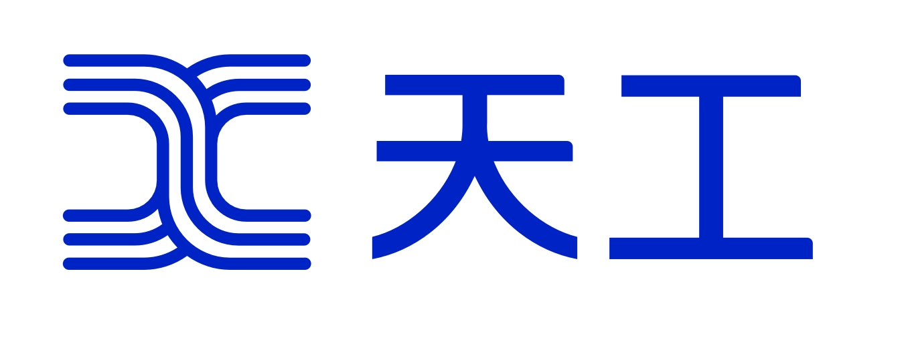
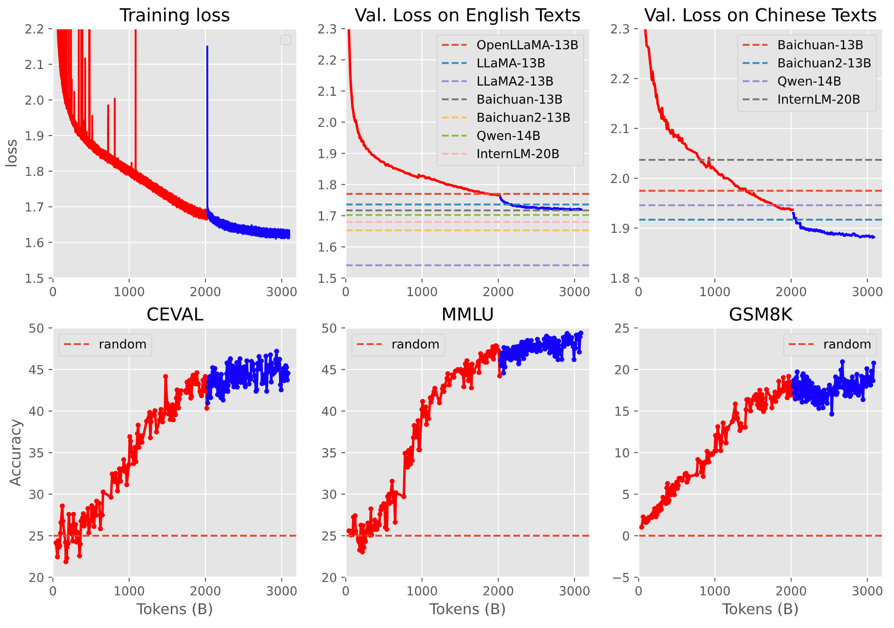
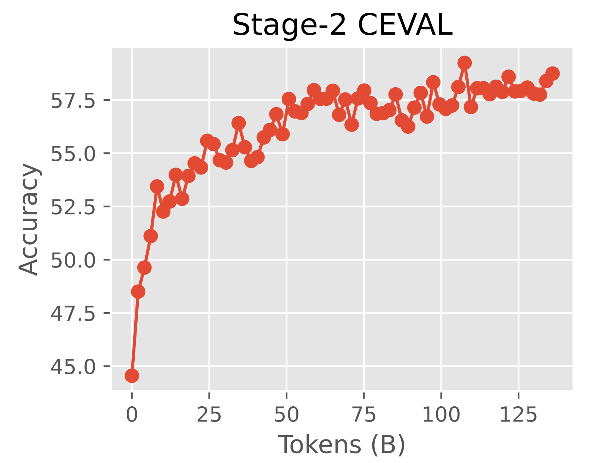

<!-- <div align="center">
<h1>
  ✨Skywork
</h1>
</div> -->
<div align="center"></div>

<p align="center">
🤗 <a href="https://huggingface.co/Skywork" target="_blank">Hugging Face</a> • 🤖 <a href="https://modelscope.cn/organization/Skywork" target="_blank">ModelScope</a> • 💬 <a href="https://github.com/SkyworkAI/Skywork/blob/main/misc/wechat.png?raw=true" target="_blank">WeChat</a>• 📜<a href="https://arxiv.org/" target="_blank">Tech Report</a>• 🧮<a href="https://arxiv.org/" target="_blank">Skywork Math Paper</a>
</p>

<div align="center">

[](https://github.com/SkyworkAI/Skywork/stargazers)
[](https://github.com/SkyworkAI/Skywork/fork)
</div>

<div align="center">


<h4 align="center">
    <p>
        <b>English</b> |
        <a href="https://github.com/SkyworkAI/Skywork/blob/main/README.md">中文</a>
    <p>
</h4>

</div>


# 💪Project Introduction
We are pleased to announce the open source release of the Skywork large-scale models. Skywork is a series of large models developed by the Kunlun Group · Skywork team. The models being open sourced this time include the **Skywork-13B-Base** model, **Skywork-13B-Chat** model, **Skywork-13B-Math** model, and **Skywork-13B-MM** model, as well as quantized versions of each model to support deployment and inference on consumer-grade GPUs.

The characteristics of the Skywork open-source project are:：

- **Skywork-13B-Base**: The model was trained on a high-quality cleaned dataset consisting of 3.2 trillion multilingual data (mainly Chinese and English) and code. It has demonstrated the best performance among models of similar scale in various evaluations and benchmark tests.

- **Skywork-13B-Chat**: The model has powerful conversational abilities, and we have further enhanced it in the field of cultural and creative industries. We have constructed a high-quality dataset of over ten thousand instructions and fine-tuned the model on ten specific cultural and creative tasks, enabling it to achieve results similar to ChatGPT in these tasks. Additionally, we open-source a benchmark consisting of approximately 500 samples for these 10 cultural and creative tasks.

- **Skywork-13B-Math**: The model has undergone specialized mathematical ability reinforcement training. In the 13B scale, the Skywork-13B-Math model ranked first in GSM8K, and it also performed well in MATH. It also showed excellent performance on the out-of-domain dataset CMATH.

- **Skywork-13B-MM**: The model supports tasks such as question answering and dialogue using image information.

- **Skywork/Skypile-150B**: This dataset is a collection of high-quality data extracted from Chinese web pages through our carefully curated data processing pipeline. The size of this open-source dataset is approximately 600GB, with a total token count of around 150 billion. It is one of the largest publicly available Chinese datasets.

- In addition, we have also disclosed the evaluation methods, data distribution studies, and training infrastructure optimization plans used in training the Skywork-13B model. We hope that these open-source materials can further inspire the community's understanding of large-scale model pre-training and drive the realization of Artificial General Intelligence (AGI).

If you are interested in more training and evaluation details, please refer to our [technical report](https://arxiv.org/skywork-tech-report) and [Skywork-Math]((https://arxiv.org/skywork-tech-report)) paper.

# 🔥 News and Updates
* 2023.10.25  We release the **Skywork-13B**， **Skywork-13B-Chat** 和 **Skywork-13B-Math**，**Skywork-13B-MM** model, as well as quantized versions of each model to support deployment and inference on consumer-grade GPUs. We  open-source the Skywork/Skypile-150B dataset. This dataset contains over 150 billion high-quality tokens cleaned from Chinese web pages, making it the largest open-source Chinese dataset currently known.


# 📖Table of contents

- [☁️Download URL](#☁️Download-URL)
- [👨‍💻Model Introduction](#👨‍💻Model-Introduction)
- [🏆Model Evaluation](#🏆Model-Evaluation)
- [📕Quickstart](#📕Quickstart)
- [📣Chat Model Output Examples](#📣Chat-Model-Output-Examples)
- [🚀Quantization](#🚀Quantization)
- [🛫Fine-tuning](#🛫Fine-tuning)
- [⚠️Declaration and License Aggrement](#⚠️Declaration-and-License-Aggrement)
- [🤝Contact Us and Citation](#🤝Contact-Us-and-Citation)


# ☁️Download URL
## Model Download URL

|         | Huggingface Base Model   | Huggingface Quantized Model |  Modelscope Base Model   | Modelscope Quantized Model |
|:-------:|:-----------:|:-----------------------------:|:-----------------------------:|:-----------------------------:|
| Skywork-13B-Base      | 🤗 [Skywork-13B-Base](https://huggingface.co/Skywork/Skywork-13B-Base) | 🤗 [Skywork-13B-Base-8bits](https://huggingface.co/Skywork/Skywork-13B-Base-8bits) | 🤖[Skywork-13B-Base](https://huggingface.co/Skywork/Skywork-13B-Base) | 🤖 [Skywork-13B-Base-8bits](https://huggingface.co/Skywork/Skywork-13B-Base-8bits) |
| Skywork-13B-Chat      | 🤗 [Skywork-13B-Chat](https://huggingface.co/Skywork/Skywork-13B-Chat) | 🤗 [Skywork-13B-Chat-8bits](https://huggingface.co/Skywork/Skywork-13B-Chat-8bits) | 🤖[Skywork-13B-Chat](https://huggingface.co/Skywork/Skywork-13B-Chat) | 🤖 [Skywork-13B-Chat-8bits](https://huggingface.co/Skywork/Skywork-13B-Chat-8bits) |
| Skywork-13B-Math      | 🤗 [Skywork-13B-Math](https://huggingface.co/Skywork/Skywork-13B-Math) | 🤗 [Skywork-13B-Math-8bits](https://huggingface.co/Skywork/Skywork-13B-Math-8bits) | 🤖 [Skywork-13B-Math](https://huggingface.co/Skywork/Skywork-13B-Math) | 🤖 [Skywork-13B-Math-8bits](https://huggingface.co/Skywork/Skywork-13B-Math-8bits) |
| Skywork-13B-MM      | 🤗 [Skywork-13B-MM](https://huggingface.co/Skywork/Skywork-13B-MM) | 🤗 [Skywork-13B-MM-8bits](https://huggingface.co/Skywork/Skywork-13B-MM-8bits) | 🤖 [Skywork-13B-MM](https://huggingface.co/Skywork/Skywork-13B-MM) | 🤖[Skywork-13B-MM-8bits](https://huggingface.co/Skywork/Skywork-13B-MM-8bits) |


## DATA Download URL
|    Data    |   | Download URL | |
|:-------:|:-----------:|:-----------:|:---------------:|
| Skywork/Skypile-150B |  [Hugging Face](https://huggingface.co/Skywork/Skywork-13B-Base) |  [Baidu Drive](https://huggingface.co/Skywork/Skywork-13B-Base) | [Google Drive](https://huggingface.co/Skywork/Skywork-13B-Base) |


# 👨‍💻Model Introduction

## Model Structure
Compared to the Llama2-13B model, the Skywork-13B model adopts a relatively thinner and deeper network structure with 52 layers. At the same time, the FFN Dim and Hidden Dim are reduced to 12288 and 4608, respectively, to ensure that the model has a similar number of parameters as the original Llama-13B model. Based on our preliminary experimental results, a relatively thinner and deeper network structure can achieve better generalization performance under large batch size training. The detailed comparison between the Skywork-13B and Llama-2-13B models is as follows:


| Model Structure         | Llama2-13B | Skywork-13B | 
|----------------------|:----:|:-----------:|
| Vocab. Size  | 32,000 |    65,536     | 
| Hidden Dim.  | 5,120 |    4,608     | 
| FFN Dim.  | 13,696 |    12,288     |
| Head Dim. | 128 |    128     | 
| Num. Heads | 40 |    36     | 
| Num. Layers | 40 |    52     | 
| Seq. Len. | 4,096 |    4,096     | 
| Positional Embedding | RoPE | RoPE |


## Tokenization
We use Byte-Pair Encoding (BPE) to tokenize the data, with a vocabulary size of 65536. Among them, there are 32000 Latin characters and subwords, 8000 Chinese characters and Unicode symbols, 25519 Chinese words, and the remaining 17 are reserved words.

| Category                            | Size    |
|---------------------------------|--------|
| Latin based words & subwords                 | 32000  |
| Chinese characters & Unicode symbols               | 8000   |
| Chinese words                        | 25519  |
| Reserved symbols                       | 17     |
| **Total**                         | **65536** |

## Training Data
The Skywork-13B-Base model was trained on a 3.2 TB dataset consisting of high-quality Chinese, English, and code data. The English portion accounts for 52.2%, Chinese for 39.6%, and code for 8%. This ensures performance on both Chinese and English, while also maintaining code capability.

 |             | Category         | Percentage |
|-------------|------------------|------------|
| **English** | Webpages         | 39.8%      |
|             | Books            | 3.6%       |
|             | Academic Papers  | 3.0%       |
|             | Encyclopedia     | 2.9%       |
|             | Miscellany       | 2.9%       |
|-------------|------------------|------------|
| **Chinese** | Webpages         | 30.4%      |
|             | Social Media     | 5.5%       |
|             | Encyclopedia     | 0.8%       |
|             | Miscellany       | 3.1%       |
|-------------|------------------|------------|
| **Code**    | Github           | 8.0%       | 


## Training Methods
In order to make more precise use of data, we adopt a two-stage training method. In the first stage, we use general corpora to train the model's general abilities. In the second stage, we incorporate STEM (Science, Technology, Engineering, Mathematics) related data to further enhance the model's reasoning, mathematical, and problem-solving abilities.

### First-stage Pretraining
During the training process, we monitor the changes in model training loss and various abilities. The following figure shows the change curves of important indicators selected during the first stage of pre-training. The first stage of pre-training consists of two consecutive training processes, which are represented by different colors. The model completed in the first stage of pre-training is referred to as Skywork-13B-3.1TB-Base.


### Second-stage Pretraining
In the second stage of pre-training, STEM-related data is added to the general language corpus for further training. The second stage training involves approximately 130 billion tokens, resulting in a total training of 3.2 TB across both stages, and yielding our final Skywork-13B-Base model.



## Data Opensource

### Dataset Summary
Skypile-150B is created to serve as a large-scale Chinese dataset for pre-training of large language models. It is taken from publicly available Chinese Internet web pages. Through strict filtering and extensive deduplication then sensitive data filtering, At the same time, fastText and Bert are used to filter low-quality data.
The public part of Skypile-150B contains approximately 166M individual web pages, with an average of over 1k Chinese characters, a total of approximately 150B tokens, and 592G plain text data.

### Language
Skypile-150B is Chinese data.

### Data Field
text:The processed and cleaned text contained in the page.

### Sensitive information and bias
Because Skypile-150B is built on publicly available web pages, it may contain sensitive information such as emails, phone numbers, or IP addresses. We believe that deduplication and low-quality filtering may help reduce this data, but practitioners working with Skypile-150B should be careful.
Since toxic or biased data is prevalent on the Internet, although we filter it using specific URL filtering methods, users should be aware.

### Social Impact of Dataset
With the open source release of Skypile-150B, we aim to increase access to high-quality web data which has typically been held private by model developers. We believe this release will in turn improve the accessibility and the spread of performant large language models.


### License Aggrement
The use of data must comply with our License and must not be used for any purpose that poses a threat to national and social security or violates the law.

# 🏆Model Evaluation

## Documentation Perplexity Evaluation
The main goal of training a language model is to improve the accuracy of predicting the next word. With this in mind, we believe that evaluating the ability of a language model to generate articles in different domains is a crucial way to assess the performance of large-scale models. During model training, the likelihood of predicting the next word is typically measured using the Cross Entropy loss function. The overall loss function is calculated as the average of the losses when predicting the correct word at each position, which can be represented as:
$$loss = \sum^{n}_{i=1} log(p_i) / n = log( \prod_{i=1}^n p_i) / n$$

Where $n$ is the length of the document, i.e., the number of tokens, and $p_i$ is the probability of the label word at position $i$. We know that the product of the probabilities of the label words at each position in the document is equal to the probability of generating that document. In this way, we connect the loss with the probability of generating the document. Since different models use different tokenizers and have different numbers of tokens, we multiply the loss function by the number of tokens $n$. This way, we only consider the part related to the probability of generating the article, and different models can be compared. We normalize the loss and convert it to perplexity by taking the exponential, making the differences between models more pronounced. For readability, the terms "loss" and "ppl" mentioned later refer to the normalized loss and perplexity of the model.

Based on the analysis above, we have chosen several hundred to thousands of high-quality articles that were published in October 2023 across various fields. We have manually verified these articles to ensure their quality. It is important to note that none of the test data used in evaluating the Skywork model or any other models is included in their training set. Furthermore, the test data is diverse and of high quality, making it challenging for the models to gain an unfair advantage.

The figure below displays the performance of different open source models. Skywork-13B-Base achieves the best results.

|                  | Tech  | Movie | Gov.  | Game  | Finance | General | Average |
|------------------|-------|-------|-------|-------|---------|---------|---------|
| MOSS-7B          | 20.83 | 39.66 | 11.08 | 31.24 | 10.59   | 13.25   | 18.50   |
| InternLM-7B      | 13.43 | 24.90 | 5.88  | 19.78 | 6.17    | 8.10    | 11.17   |
| Qwen-7B          | 13.39 | 25.16 | 5.55  | 19.26 | 5.76    | 7.78    | 10.83   |
| Baichuan2-7B     | 12.89 | 23.26 | 5.34  | 18.36 | 5.68    | 7.62    | 10.41   |
| LLaMA2-13B       | 23.26 | 50.66 | 18.09 | 32.52 | 14.85   | 16.55   | 23.54   |
| Xverse-13B       | 12.55 | 23.49 | 5.20  | 17.69 | 5.54    | 7.46    | 10.19   |
| Baichuan-13B     | 12.38 | 22.46 | 5.21  | 17.59 | 5.42    | 7.37    | 10.03   |
| Baichuan2-13B    | 12.14 | 21.85 | 5.05  | 17.15 | 5.35    | 7.24    | 9.81    |
| Qwen-14B         | 11.90 | 22.43 | 4.89  | **16.94** | 5.24    | 7.03    | 9.67    |
| InternLM-20B     | 12.34 | 22.06 | 5.75  | 17.45 | 5.73    | 7.78    | 10.34   |
| Aquila2-34B      | 14.62 | 29.09 | 5.72  | 21.78 | 5.83    | 8.45    | 11.73   |
| Skywork-13B-Base | **11.58** | **21.84** | **4.76**  | 17.28 | **4.92**    | **6.82**    | **9.42**    | 

## Benchmark Results
We evaluated Skywork-13B-Base on several popular benchmarks, including C-Eval, MMLU, CMMLU, and GSM8K. Following the previous evaluation process, we tested the 5-shot results of C-Eval, MMLU, and CMMLU, and the 8-shot results of GSM8K. It can be seen that the Skywork-13B-Base model is among the top models in the Chinese open source model community, performing at an optimal level with the same parameter scale.

| Model            | C-Eval  | CMMLU | MMLU | GSM8K |  
|-------------------------|:-----:|:---------------:|:----------:|:-------:|
| LLaMA-1-13B-Base            | 35.5  | 31.2            | 46.9       | 17.8   | 
| Open-LLaMA-13B | 27.1  | 26.7         | 42.7       | 12.4   |
| LLaMA-2-13B-Base             | 36.5  | 36.6            | 54.8      | 28.7   | 
| InternLM-20B  | 58.8  |     -        |  62.0      | 52.6   | 
| Qwen-14B-Base | 72.1  |  71.0           | 66.3       | 61.3   |
| Aquila2-34B-Base | 63.1  |  71.4           | 64.2       | 58.4   |
| XVERSE-13B-Base              | 54.7  | -           | 55.1       | -   | 
| Baichuan-13B-Base | 52.4  | 55.3            | 51.6      | 26.6   |
| Baichuan-2-13B-Base | 58.1  | 62.0            | 59.2       | 52.3  |
| Skywork-13B-Base (ours)   | 59.5 | 61.6 | 61.6    | 55.8 | 

## Detailed Benchmark Results
We provide detailed results of the Skywork-13B-Base model on C-EVAL, CMMLU, and MMLU.

| Benchmark | **STEM** | **Humanities** | **Social Science** | **Other** | **China Specific** | **Hard** | **Average** | 
|:-----:|:---------:|:--------:|:-------------:|:--------:|:--------:|:--------:|:--------:|
| **C-EVAL** |   51.5   | 65.1    | 73.9        |  55.1   | - | 39.9   |  59.5   |
| **CMMLU**   |   49.8   | 68.9    | 65.6        |  62.8   | 63.7 | -   |  61.6   |
| **MMLU**   |   50.6   | 57.8    | 71.9       |  68.3   | - | -   |  61.6   |


# 📕Quickstart
We have open-sourced the model parameters, configuration files, tokenizer, and more on Hugging Face.
## Requirements
```shell
pip install -r requirements.txt 
```
## Demonstration of Huggingface Model Inference
### Chat Model Inference
```
from transformers import AutoModelForCausalLM, AutoTokenizer
from transformers.generation import GenerationConfig
import torch

tokenizer = AutoTokenizer.from_pretrained("SkyworkAI/Skywork-13B-Chat", trust_remote_code=True)
model = AutoModelForCausalLM.from_pretrained("SkyworkAI/Skywork-13B-Chat"", device_map="auto", trust_remote_code=True).eval()

inputs = tokenizer('请帮我制定一下北京的旅游计划', return_tensors='pt').to(model.device)
response = model.generate(inputs.input_ids)
print(tokenizer.decode(response.cpu()[0], skip_special_tokens=True))

```

### Base Model Inference

```python

>>> from transformers import AutoModelForCausalLM, AutoTokenizer
>>> from transformers.generation import GenerationConfig
>>> import torch

>>> tokenizer = AutoTokenizer.from_pretrained("SkyworkAI/Skywork-13B-Base", trust_remote_code=True)
>>> model = AutoModelForCausalLM.from_pretrained("SkyworkAI/Skywork-13B-Base", device_map="auto", trust_remote_code=True).eval()

>>> inputs = tokenizer('陕西的省会是西安', return_tensors='pt').to(model.device)
>>> response = model.generate(inputs.input_ids, max_length=128)
>>> print(tokenizer.decode(response.cpu()[0], skip_special_tokens=True))
陕西的省会是西安，西安是我国著名的古都，在历史上有十三个朝代在此建都，所以西安又被称为“十三朝古都”。西安是我国著名的旅游城市，每年都有大量的游客来到西安旅游，西安的旅游资源非常丰富，有很多著名的旅游景点，比如秦始皇兵马俑、大雁塔、华清池、大唐芙蓉园、西安城墙、大明宫国家遗址公园、西安碑林博物馆、西安钟楼、西安鼓楼、西安半坡博物馆、西安大兴善寺、西安小雁塔


>>> inputs = tokenizer('陕西的省会是西安，甘肃的省会是兰州，河南的省会是郑州', return_tensors='pt').to(model.device)
>>> response = model.generate(inputs.input_ids, max_length=128)
>>> print(tokenizer.decode(response.cpu()[0], skip_special_tokens=True))
陕西的省会是西安，甘肃的省会是兰州，河南的省会是郑州，湖北的省会是武汉，湖南的省会是长沙，江西的省会是南昌，安徽的省会是合肥，江苏的省会是南京，浙江的省会是杭州，福建的省会是福州，广东的省会是广州，广西的省会是南宁，海南的省会是海口，四川的省会是成都，贵州的省会是贵阳，云南的省会是昆明，西藏的省会是拉萨，青海的省会是西宁，宁夏的省会是银川，新疆的省会是乌鲁木齐。


```

# 📣Chat Model Output Examples
We have developed an advanced Skywork scene capability system and curated a dataset of more than 10,000 high-quality examples for 10 different cultural and creative scenes. Additionally, we have devised a data mixing strategy that takes into account the training difficulty of each specific scene. As a result, our model achieved an accuracy rate exceeding 90% across all 10 scenes in ChatGPT. Below, we list sample demonstrations of our Chat model in these 10 cultural and creative tasks.

<details><summary><b>Poetry Creation</b></summary>

`````

用户：
你能创作一首以“金秋十月”为藏头词的诗吗？

Skywork-13B-Chat:
金色稻田浪滔滔，
秋风吹过几多娇。
十里飘香美食街，
国庆佳节喜气生。

用户：
请使用生动的意象和描绘手法，创作一首描绘夜晚星空的七言绝句。

Skywork-13B-Chat:
星河璀璨夜未央，
浩渺天际觅清凉。
繁星点点映幽暗，
银河耿耿照寒秋。

用户：
学校马上举办辩论赛了，希望写一首五言律诗预祝辩论赛圆满顺利，各位选手发挥优越

Skywork-13B-Chat:
赛场展雄风，辩才争锋芒。
临危不惧勇，破釜沉舟忙。
舌灿莲花吐，珠玑溅齿旁。
腹有千秋虑，挥洒文字香
`````

</details>


<details><summary><b>Advertising Proposal</b></summary>

`````
用户：
帮我给华为智能家居设计一条广告语，重点体现智能家居改变生活、让生活更便利

Skywork-13B-Chat: 
华为智能家居，科技融入生活，让您的家充满可能。

用户：
以做一个《十天狂减30斤》的海报，海报要求包含健身前后的对比，最终通过健身减肥走向人生巅峰

Skywork-13B-Chat:
海报设计：

标题：《十天狂减30斤，你也可以！》

背景：黑色背景，象征着健身的艰辛和挑战。

左上角：一个明显的标志性logo，可以是一个肌肉线条图或者一个燃脂的图标，代表健身的过程。

右上角：一个成功减去30斤体重的人物形象，穿着帅气的衣服，站在山顶，面带微笑，手持哑铃，舞动手臂，展示出他/她已经完成了这个目标。人物形象应该占据海报的大部分空间，突出重点。

中部：一个倒计时的日历图像，显示还剩下的时间，强调“十天”这个词，以及一些关于健身的提示，比如“均衡饮食+适量运动”。

下部：一些鼓励的话，比如“相信自己，你一定可以的！”或者“汗水铸就辉煌，减肥就是改变生活！”

颜色：主要使用橙色和白色，橙色代表热情和活力，白色代表纯洁和期待。

整体设计：简洁明快，充满动力，易于记忆，引人注目。

文案：清晰明了，字体大且显眼，内容简短有力，节奏紧凑，引人入胜。

附加元素：可以添加一些与健身相关的小插图或者漫画，如举哑铃、跑步、瑜伽等，使海报看起来更有趣味性。

整体风格：简约、直接、自信、激励。 


用户：
我主要是做母婴产品的电商直播，最近正值6.18，全体商品打8折最低折扣6.8折。写一份微博动态，能够吸引关注我的人及时进入直播间抢福利

Skywork-13B-Chat：
亲爱的朋友们，好消息！随着6.18购物狂欢节的到来，我们的母婴产品直播间准备了一系列惊喜优惠给大家！全场商品8折起，最低折扣6.8折，品质好货，轻松入手！

️新品推荐：

欢迎来到我们的直播间，首先为大家推荐一款全新上市的母婴产品——【XX品牌婴儿推车】，它采用优质材料，轻便易折叠，设计精美，让你的宝宝在出行时享受到最舒适的体验。还有【YY品牌智能儿童手表】，定位准确，通话清晰，是孩子成长的必备安全装备。

福利预告：

不仅如此，我们还准备了一系列限时福利活动，包括满额免邮、抽奖送豪礼、新品试用等，只要你足够活跃，这些福利就是你的！记得锁定我们的直播间哦！

时间安排：

请大家准时参加我们的直播，分享更多的购物心得和优惠信息。我们将在每天下午3点开始直播，晚上9点结束。期待您的参与，一起度过这个愉快的6.18！

#6.18购物节# #母婴产品# #直播间# 

用户：
我是一名运动员，最近比赛取得很好的成绩受到大家的关注和认可。帮我写一份微博文案，帮我感谢大家支持我，要有日常感，并语言随意一些

Skywork-13B-Chat：
然！以下是一份简单的微博文案：

大家好！非常感谢大家对我最近比赛的关注和支持！真的非常感激！每一个人的鼓励和支持都是我前进的动力。无论是家人、朋友、教练还是队友，你们一直以来的陪伴和支持都是我走向成功的重要推动力。特别要感谢我的父母，他们始终给予我无尽的爱和关怀，是你们让我有了勇气和决心去追求梦想。同时，也要感谢我的教练和队友们，你们的指导和帮助让我不断进步，每一次失败都让我更加坚强，每一次成功都让我更加谦虚。 

在这个充满竞争的旅程中，我深深感受到了努力和坚持的重要性。没有什么是轻而易举就可以实现的，每一个成功背后都隐藏着无数的汗水和付出。我希望通过我的努力和坚持，能够激励更多人参与这项运动，追逐自己的梦想。

这个成就只是我人生中的一小部分，我会继续努力学习和成长，为更高的目标奋斗。未来的路还很长，但我相信，只要有你们的支持和鼓励，我一定能走得更远。请大家继续关注我的动态，见证我的成长和努力！

再次感谢大家的支持！爱你们！

#运动员# #拼搏精神#
`````

</details>

<details><summary><b>Composition Generation</b></summary>

`````
用户：
以“做一个有责任心的人”写一篇议论文。要求：⑴题目自拟，文体不限；⑵字数不少于600；⑶文中不得出现真实的姓名、校名、地名。

Skywork-13B-Chat
标题：做一个有责任心的人

在这个竞争激烈的社会中，每个人都扮演着不同的角色，承担着相应的责任。一个有责任心的人，不仅要对自己负责，还要对他人、集体和社会负责。那么，什么是责任心呢？简单来说，就是对自己、对他人、对社会的承诺和义务的自觉履行。一个有责任心的人，会主动承担起自己的责任，尽心尽力地完成每一项任务，不抱怨不推诿，勇于面对困难和挑战。本文将从以下几个方面论述如何成为一个有责任心的人。

首先，作为一个有责任心的人，我们应该对自己负责。对自己负责，意味着要关爱自己的身心健康，努力提高自身素质。我们要树立正确的人生观和价值观，认识到人生的意义在于奉献和成就。我们要不断学习，充实自己，为个人和社会的发展做出贡献。同时，我们也要关爱自己的情感世界，保持良好的人际关系，培养积极的心态，勇往直前，追求进步。

其次，作为一个有责任心的人，我们应该对他人负责。对他人负责，意味着关心他人，帮助他们解决问题，给予关爱和支持。我们要学会站在别人的角度思考问题，理解和尊重他人，乐于助人，尽可能地帮助那些需要我们帮助的人。我们要学会包容和接纳他人的不足，鼓励他们，给予他们信心和勇气。当我们看到身边的人遇到困境时，我们要敢于伸出援手，帮助他们度过难关。这样，我们才能赢得别人的尊重和信任，也能更好地融入社会。

再次，作为一个有责任心的人，我们还应该对社会负责。对社会负责，意味着要遵守法律法规，维护社会公德，关心社会公益，为社会的和谐稳定做出贡献。我们要做到诚信守法，言行一致，积极参与社会公益活动，关心社会上的弱势群体，尽自己所能去回报社会。我们要用自己的实际行动践行社会主义核心价值观，传播正能量，带动周围的人共同为构建和谐社会贡献力量。

总之，做一个有责任心的人，既是对自己的负责，也是对他人和社会的负责。我们要时刻牢记自己的责任，把责任心化为行动的动力，不断提升自己的道德品质，努力成长为一个有责任心的人。只有这样，我们才能在这个纷繁复杂的社会中立足，实现自己的价值和梦想。 

用户：
写一篇关于圆规的功能、构造和使用方法的说明文，200字左右，题目自拟。

Skywork-13B-Chat：
标题：圆规
圆规是一种常见的绘画工具，它的主要功能是画出完美的圆形。它由两个部分组成：笔头和笔杆。笔头通常是由硬质塑料制成，呈圆锥形，尖端可以旋转，使画家能够轻松地描绘出精确的圆形。笔杆一般为木质或塑料制，内部装有弹簧，可固定笔头。当需要绘制圆形时，只需将笔头旋转到所需大小并轻轻接触纸面，即可画出一个清晰的圆。圆规也常用于辅助建筑设计、机械制造等领域的绘图工作。此外，圆规还可以作为一种教学工具，帮助学生更好地理解和掌握几何形状。在使用圆规时，请确保正确握笔，用力均匀，以获得最佳的绘画效果。


用户：
请以夏夜雨后漫步为主题写一篇散文，通过描写雨后清凉的夜晚氛围，反思现实社会的不安和焦虑，并展现一种积极的生活态度。

Skywork-13B-Chat：
标题：《夏夜雨后的宁静》
夏夜，炎热与喧嚣相伴，像是现实社会中每一个人的繁忙和焦虑。但那天晚上，一场突如其来的雨洗净了夜空的炽热，也沉淀了城市的喧闹。雨后的空气如同凉茶，带着微微的甜，清爽入心。我踏出家门，漫步在这个由雨水涤洗过的世界，试图寻找一些清凉，以及那份久违的宁静。
刚经历了一场纷扰的城市，仿佛换了副面孔。那些被炎炎烈日烤得炙热无比的柏油马路，那些反射着霓虹灯光的玻璃幕墙，都在雨中显得如此清新。树叶轻轻摇曳，低语着大自然的韵律。空气中弥漫着淡淡的青草香，那是雨后的味道，混合着泥土的气息，让人心旷神怡。
脚下的积水倒映着天空的云彩，涟漪一圈圈荡漾开去。远处的灯火逐渐亮起，星星点点的光点缀着这片夜色。车流渐少，街道变得空旷而静谧。偶尔几辆汽车经过，也只是留下一阵阵短暂的水花涟漪。人们早早躲进了屋子里，享受室内的凉爽。而我却选择在这夜色里，任凭雨滴打湿发丝，尽情地呼吸着雨后的新鲜空气。
突然，一阵风吹落了树梢的叶子，伴随着“沙沙”声，宛如大自然的低语。这些叶子在空中飘舞，最后静静地躺在了我的手心。这一刻，我仿佛感受到了生命的律动，那是一种坚韧的力量，一种令人感动的美丽。这风，这雨，这夜色，都让我想起了人生中的某些时刻。
那晚，我思考着自己的人生。每个人都在忙碌、奔波，为了生活而焦躁不安。可是，当我们停下脚步，回望过去，是不是能找到那颗初心？是不是能找回那份曾经的梦想？是不是能拥有那份对生活的热爱和期待？
雨后的世界，是那么纯净；雨后的天地，是那么和谐。我想，生活就像这场雨后的清凉，给我们带来的不仅仅是舒爽，更是希望。我们应该珍惜眼前的一切，珍惜每一个瞬间，因为时光荏苒，岁月如梭，我们都会老去。
有时候，我们需要放慢脚步，去感受生活的美好。不要让自己成为时间的奴隶，而是要学会欣赏它的流逝，享受它带给我们的种种奇妙。我们可以在繁华的城市中找一处安静的角落，聆听大自然的声音，让心灵得以平静。我们可以在忙碌的工作中抽出时间，去体验生活的真谛，让自己成为一个有温度的人。
生活本不缺少美，只是缺少发现美的眼睛。同样，生活本不缺少快乐，只是缺少追求快乐的心境。面对现实的不安和焦虑，我们更需要一颗平和的心，去体会生活的酸甜苦辣，去品尝那些细碎的幸福。
夏夜雨后，我沉浸在这样的夜晚，反思着人生的种种。我感谢这个世界，感谢这场雨，更感谢生活给予我的一切。因为它让我明白了，无论怎样的挫折、困难，都是生活的馈赠，是我们成长的痕迹。只要我们用心去感受，用眼去欣赏，用勇气去面对，我们的生活定会如这雨后的世界一般，清新、明朗、充满希望。

`````

</details>

<details><summary><b>Speech Generation</b></summary>

`````
用户：
写一个关于环保的演讲稿,5~10分钟的,内容不要太深奥，举一些相关的例子

Skywork-13B-Chat：
尊敬的听众们：
大家好！今天我非常荣幸能够在这里与大家分享有关环保的话题。环保，是我们每个人都应该关注和重视的议题，因为它关系到我们每一个人的生活质量和地球的未来。

让我们先来想象一下，我们的地球是如何被我们所破坏的。空气污染、水污染、垃圾围城，这些问题已经深深地影响着我们的日常生活。我们每天都在使用能源，但是却没有意识到能源的有限性和对环境的影响。森林被砍伐，动物的栖息地被破坏，物种灭绝的速度加快。我们的地球正在发出痛苦的呼声，而我们却常常忽视了这些问题，继续过着浪费和贪婪的生活。

现在，越来越多的科学家和研究人员告诉我们，如果我们不采取行动，那么未来的世界将不再适合人类居住。我们需要改变我们的行为，减少对环境的破坏，并保护我们的地球。

幸运的是，我们有许多可以采取的措施来改善环境状况。首先，我们可以从家庭开始，通过节约用水、减少用塑料袋、垃圾分类等简单的行动来减少碳足迹。我们还可以选择购买环保产品，支持那些致力于环保的企业，促进可持续生产和发展。此外，我们还可以积极参与社区活动，如植树、清理垃圾、宣传环保知识等，让更多的人参与到环保行动中来。

政府也在积极推动环保政策，制定法规和政策来限制污染和资源浪费。例如，建设绿色建筑、推广新能源技术、加强废物回收利用等，这些举措不仅能降低环境污染，还能创造新的就业机会和经济效益。

然而，真正的改变需要我们每个人的共同努力。我们必须认识到，环保不仅是一种责任，更是一种智慧。当我们保护环境时，我们也在保护我们自己。我们的地球是我们共同的家园，只有我们共同努力，才能让它变得更加美好。

最后，我想呼吁大家，让我们一起行动起来，为环保贡献自己的力量。从小事做起，从身边做起，以实际行动来保护我们的地球。让我们携手并肩，为下一代创造一个更美好的世界！

谢谢大家！ 


用户：
写一份动漫社的专场主持词？最好热血，中二一点。

Skywork-13B-Chat：
尊敬的各位老师，亲爱的同学们，大家好！

欢迎来到这场激动人心的动漫社专场活动！我是您的主持人（主持人姓名），今天将会为大家带来一场充满热情和欢乐的动漫盛宴！我们的主题是——“动漫，不止于二次元”。

动漫，这是一个广受欢迎、备受喜爱的文化形式，它不仅仅存在于二维世界，更在我们每一个人的心中燃烧着三次元的热血与激情。今天，让我们一起走进这个精彩纷呈、无限可能的动漫世界，一同分享那些令人着迷的故事、角色和创作背后的魅力。

首先，让我们重温那些年，那些被誉为经典的动漫作品。从《火影忍者》中的坚韧与奋斗，到《进击的巨人》中的勇气与冒险，再到《海贼王》中的梦想与希望，这些都是动漫所带给我们的，不仅仅是视觉上的冲击，更是心灵深处的触动。这些故事，就像一盏盏明灯，照亮我们内心的世界，给我们提供了无数次的感动和启示。

接下来，我们将带您进入更加精彩的环节。我们邀请了一些对动漫有着独特见解和热爱的嘉宾们，他们将与大家分享他们的心得，讲述他们的故事，让我们一起深入探讨动漫的魅力和影响力。

在这个环节中，我们将有幸听到来自不同领域的动漫爱好者们分享他们的观点，无论是从动漫的制作过程，还是从动漫的艺术设计，亦或是从动漫的社会影响，他们都有自己独到的看法。听他们娓娓道来，相信会给您带来新的视角和启发。

最后，我们还准备了一系列的互动环节，让大家可以尽情展示自己的才华，释放自己的热情。不论是cosplay、短片拍摄，还是动漫绘画，这里都有你施展的舞台。请大家积极参与，让我们一起享受这场属于我们的动漫盛宴！

各位同学，我们都是生活的漫画家，我们用心灵手巧的双手创造出属于我们的动漫世界。让我们用热情点燃热情，用激情传递激情，让动漫的力量在我们每个人身上得以展现，让我们的社团生活更加精彩。

让我们一起，用热血的心，燃烧二次元的热情，共同创造出更多的精彩！感谢大家的参与，我们的动漫社，期待与你们一起，继续在二次元的世界里，寻找那份永不消逝的热血和激情！

谢谢大家！ 

`````

</details>

<details><summary><b>Experience and Reflections</b></summary>

`````

用户：
写一篇关于《茶馆》的800字读后感

Skywork-13B-Chat：
《茶馆》是中国现代文学的经典之一，由著名作家老舍创作。这部小说以其独特的艺术魅力和深刻的社会寓意，赢得了广大读者的喜爱和赞誉。阅读这部作品，不仅让我感受到了文学的深度和力量，也使我对生活有了更深的理解和思考。

首先，我被《茶馆》的语言所吸引。老舍先生的文字简洁明了，却又充满诗意。他运用了丰富的意象和生动的描绘，将茶馆里的人物和场景活灵活现地呈现在读者面前。我仿佛能看到那些穿着长衫、马褂的人物形象，听到他们的对话和动作，感受到他们的情感和思想。这种语言的魅力，使得《茶馆》不仅仅是一个简单的故事，更是一幅生动的社会画卷。

其次，我被《茶馆》的主题所打动。这部小说通过对茶馆里不同阶层人物的描绘，展示了人性的复杂和社会的矛盾。无论是茶馆老板、伙计、顾客，还是各种身份的人，都有着各自的追求和挣扎，他们的命运交错在一起，形成了一幅丰富多彩的社会画卷。这使我深刻体会到人生的无常与无奈，以及人们在现实生活中的挣扎和困惑。

再次，我被《茶馆》的角色所吸引。每个角色都有自己的性格和特点，他们的行为和选择都让人深思。比如，茶馆老板王利发，他虽然身处底层，但却有着善良和正义；比如，革命者宋恩子，他勇敢地反抗压迫，争取自由；比如，地主刘麻子，他虽然狡猾残忍，但也有自己的苦衷。这些角色的塑造，让我看到了人性的多样性和复杂性，也使我对生活有了更深的认识。

最后，我被《茶馆》的深层含义所震撼。这部小说看似在讲述茶馆里的故事，但实则在揭示社会的本质。老舍通过茶馆这个小小的舞台，巧妙地展现了大时代下的人性和社会问题。他对人性的深刻剖析，对社会的尖锐讽刺，让我深感生活的无奈和悲哀。同时，他也给我们提供了一个反思的视角，让我们看到了生活中的不公和荒谬。

总的来说，《茶馆》是一部深入人心的作品，它的语言、主题和角色都让我留下了深刻的印象。阅读这部作品，就像在看一面镜子，让我看到了生活的真实面貌，也让我看到了自己的影子。我相信，《茶馆》会成为我心中的经典，因为它用其独特的艺术魅力和深刻的内涵，引导我去思考人生和社会，去体验喜怒哀乐，去品味生活的真谛。 


用户：
写一遍经历过电工实训的心得，内容包含焊接、双联开关接线和画电路板
Skywork-13B-Chat：
在过去的一段时间里，我有幸参加了一次电工实训课程，这段时间的学习和实践让我对电力工程有了更深入的理解和掌握。我想通过这篇文章分享一下我在实训过程中的心得体会，包括焊接、双联开关接线和画电路板等方面的学习经验。
首先，我觉得焊接是一个非常重要的技能。在我们的课程中，我学会了如何使用电烙铁和焊锡丝，以及各种电线电缆的连接方法。虽然一开始我对这个过程感到有些困难，但是通过不断的尝试和练习，我逐渐掌握了技巧。我了解到焊接不仅需要耐心和细心，还需要有一定的力量控制，以确保电路的安全性和稳定性。同时，我也认识到，焊接不仅仅是一种技术，更是一种艺术，它需要你懂得如何根据实际情况调整焊接的力度和角度，以实现最佳的结果。
其次，我对双联开关接线有了新的理解。在课堂上，我们学习了两个以上的开关如何并联，这对于我来说是一个很好的机会，可以锻炼我的逻辑思维能力。我发现，双联开关的接线需要考虑到电流的流向，以及各个元器件之间的相互关系。这要求我在操作时必须谨慎，确保每个开关都能正常工作，否则整个电路就无法正常运行。我在实践中体验到，理论知识和实际操作的结合是非常重要的，只有这样才能真正掌握这种技能。
最后，我深感画电路板的复杂性。在开始学习画电路板之前，我以为这只是一项简单的任务，但实际上它涉及到了很多的原理和细节。我在导师的指导下，逐步学习了如何使用绘图工具，以及如何根据设计绘制出精确的电路图。我了解到，每一个元件的位置，每一根电线的走向，都需要仔细考虑，才能最终完成一个完整且功能正常的电路板。这对我来说是一个挑战，但也是一个非常有意义的学习过程。
通过这次实训，我更加深入地理解了电力工程的实质和魅力。我看到了理论知识在实践中的应用，也学到了很多在校园里无法学到的知识和技能。我相信，这些经验将会对我未来的学习和工作带来很大的帮助。总的来说，我觉得这次实训是一次非常宝贵的学习机会，使我对电力工程有了更深的理解和提高。我期待将来能有更多的机会参加这样的活动，以提升自己的技能和知识。

`````

</details>

<details><summary><b>Technology Manuscript</b></summary>

`````

用户：
最近在写“绿色材料的研究与开发”为题的论文，你能帮我写一个大纲吗？

Skywork-13B-Chat：
标题：绿色材料的研究与开发

I. 引言
 A. 背景介绍
 B. 目的和重要性
 C. 研究问题的提出
 D. 文章结构

II. 文献综述
 A. 绿色材料的定义和分类
 B. 绿色材料的发展历程
 C. 绿色材料的研究现状及趋势

III. 绿色材料的研究方法
 A. 实验设计和步骤
 B. 数据收集和分析
 C. 模型构建和评估
 D. 案例研究

IV. 绿色材料的开发
 A. 新型绿色材料的创新
1. 新材料的合成和制备
2. 新材料的性能和应用
B. 改进现有绿色材料的方法
3. 提高材料效率
4. 降低环境影响
C. 政策和市场因素对绿色材料开发的影响

V. 成功案例
 A. 具体案例描述
 B. 案例分析
 C. 案例的启示和教训

VI. 挑战与未来展望
 A. 当前绿色材料研究的挑战
 B. 未来研究方向
 C. 预期成果

VII. 结论
 A. 本文的主要发现和观点
 B. 对未来研究的建议

参考文献

这是一个基本的大纲，你需要根据自己的研究进行修改和扩展。每个部分应该包含你的研究的具体内容、方法、结果和讨论。 

用户：
请以“集成了健康监测功能”的视角帮我写一篇关于智能桌子的专利说明书？

Skywork-13B-Chat：
发明名称：智能桌子

技术领域：
本发明涉及一种智能家具，尤其是一种集成了健康监测功能的智能桌子。

背景技术：
传统的桌子仅仅满足了人们对办公、学习等基本功能的需求，没有提供更多的附加价值。然而，现代社会人们越来越注重身体健康，因此需要一种智能桌子，它可以实时监测用户的健康状况并提供相应的反馈和建议。

发明内容：
本发明的目的是提供一种集成了健康监测功能的智能桌子，该桌子可以实时监测用户的健康状况，如心率、血压、血糖等生理参数，并将这些数据通过无线网络发送到云端进行存储和分析。同时，该桌子还可以根据用户的健康情况为其提供个性化的建议，例如饮食建议、运动建议等。

为了实现上述功能，本发明采用以下技术方案：
1. 一张普通的桌子，包括桌面、桌腿、以及连接板；
2. 在桌面下方安装一个传感器模块，该模块可以检测用户的生理参数，如心率、血压、血糖等；
3. 连接板设计成可触摸的形式，用户可以通过触摸连接板来启动和停止监测过程；
4. 数据处理单元，用于接收来自传感器模块的数据，并将数据传输到云端进行处理和分析；
5. 显示单元，用于显示用户的健康数据和相关建议。

优点：
6. 本发明的智能桌子可以实时监测用户的健康状况，让用户随时了解自己的健康状态；
7. 通过连接板上的触摸界面，用户可以方便地查看和管理自己的健康数据；
8. 数据处理单元将数据传输到云端进行分析，用户可以在任何地方通过手机或电脑查看自己的健康数据；
9. 显示单元可以根据用户的健康数据提供个性化的建议，帮助用户改善生活习惯，提高生活质量。

附图说明：
附图1是本发明的结构示意图，其中：
- 图1a显示了智能桌子的正面视图；
- 图1b显示了智能桌子的背面视图；
- 图1c显示了传感器模块的位置；
- 图1d显示了连接板的位置；
- 图1e显示了数据处理单元和显示单元的位置。

具体实施方式：
以下是本发明的一种具体实施方式的简要描述，但并不限制本发明的范围。
10. 智能桌子包括桌面、桌腿、以及连接板，其中连接板位于桌面下方；
11. 连接板上设有一个触摸界面，用户可以通过触摸界面启动和停止监测过程；
12. 连接板的一侧设有数据处理单元，用于接收传感器模块的数据并将数据传输到云端；
13. 连接板的另一侧设有显示单元，用于显示用户的健康数据和相关建议；
14. 传感器模块固定在桌面上，可以检测用户的生理参数，如心率、血压、血糖等。

本发明的围护范围：
任何对本发明的修改和等同替换都应包含在本发明的保护范围内。

以上所述只是本发明的具体实施方式，技术特征可在不脱离本发明原理的基础上进行改变和变动。

申请日期：xxxx年xx月xx日 

用户：
帮我写一篇关于针灸的科普文章

Skywork-13B-Chat
标题：针灸：古老的中医疗法，神奇的疗效

在中国数千年的文化传统中，针灸是一种备受推崇的古老中医疗法，它源于古代的导引术，融合了人体经络学和针刺技术。随着世界对中医的了解和接受程度越来越高，针灸治疗也逐渐在世界范围内被广泛应用。那么，什么是针灸？它有哪些优点和副作用？这篇文章将为你详细介绍这种神秘的中医疗法。

针灸，又称为针刺，是通过在人体特定穴位上插入细针，以达到疏通经络、调节气血、平衡脏腑功能的目的。它是中医理论的重要组成部分，主张“气滞则不通，不通则痛”，通过针刺穴位，可以消除疼痛，促进身体健康。针灸不仅可以治疗急性疾病，如头痛、肩周炎等，还可以调理慢性病，如高血压、糖尿病等。此外，针灸还能增强人体免疫力，预防一些常见疾病。

针灸的优点主要体现在以下几个方面：

1. 安全性高：针灸是一种侵入性较小的疗法，其针头极细，对周围组织损伤很小。同时，针灸过程中可以根据患者的反应进行调整，避免过度刺激。

2. 双向调节：针灸具有双向调节作用，既可以缓解炎症，又可以升高局部的代谢率，有助于康复。

3. 高效：大量临床实践表明，针灸对于许多疾病的治疗效果显著。例如，针灸可以有效降低高血压病患者的血压，改善糖尿病患者的血糖控制。

4. 低毒副作用：与许多化学药物相比，针灸无任何毒副作用，不会产生严重的不良反应。

然而，针灸也存在一些潜在的副作用：

2. 疼痛：部分患者在接受针灸治疗时，可能会出现短暂的疼痛感。这通常可以通过选择合适的针具、针刺手法以及加强患者的耐受力来减轻。

2. 出血：在针灸过程中，可能会出现轻微的出血。这是正常现象，但需要及时处理，以免引起感染或其他并发症。

3. 神经损伤：在极少数情况下，针灸可能会导致神经损伤。这主要发生在针刺深层肌肉时，应尽量避免此类情况的发生。

总的来说，针灸是一种安全、有效的古老中医疗法，具有独特的优势。但每个人的体质和病情不同，对针灸的反应也有所不同，因此在接受针灸治疗前，最好咨询专业的中医师，了解自己是否适合针灸治疗，以及如何正确地接受针灸治疗。同时，选择正规的医疗机构和有资质的医生进行治疗，也是非常重要的。 
`````

</details>

<details><summary><b>Record Text</b></summary>

`````
用户：
写一篇关于房地产的工作日志

Skywork-13B-Chat：
日期： xxxx年xx月xx日

天气：晴

今天是一个繁忙的日子，因为我代表公司与几位潜在的购房者进行了深入的谈判。早上，我与买家A在公司会议室就他们感兴趣的一套公寓进行了详细的讨论。我们从地理位置、周边设施、户型设计和装修风格等方面进行了全面的交流，并根据他们的需求调整了房屋销售方案。最终，我们达成了初步的协议，这让我感到非常兴奋。

上午10点，我会见了另一位潜在客户B，他对我们的一栋豪华别墅产生了浓厚的兴趣。我们讨论了不同的房型和价格选项，并就土地所有权和物业管理等问题进行了探讨。客户B提出了一些有深度的问题，我通过耐心解答和解决方案，成功地解决了他的疑虑。

下午2点，我参加了一场关于地产市场趋势的电话会议，主要是为了了解最新的市场动态和竞争对手的情况。这对我今后的工作非常有帮助，因为它使我能够更好地定位我们的房产项目，并为客户提供更优质的服务。

下午3点，我处理了一些文件，包括房屋贷款申请和产权转移手续。虽然这些工作很繁琐，但我意识到它们对于交易的完成至关重要。我确保所有的文件都准确无误，以避免任何延误或错误。

傍晚6点，我回到办公室，整理了一下明天要处理的邮件和更新了房源信息。我还预约了一个客户C，他将过来参观我们的样板房。我预计他会对我们的新开发项目产生浓厚的兴趣，所以我已经做好了充分的准备。

晚上8点，我结束了今天的工作，回顾了一下今天的工作成果。虽然忙碌，但我觉得非常充实。期待明天能带来更多的机会和挑战。

今日总结：今天的工作主要集中在与客户的沟通、市场研究和文件处理上。尽管任务繁重，但我很享受这种忙碌的感觉，因为它让我明白我正在为实现公司的目标而努力。明天我将继续致力于寻找更多的潜在客户，并尽力满足他们的需求。 

用户：
请为我创作一篇关于城市交通规划的实践报告，内容要涉及到交通流量、公共交通优势和市民出行习惯，不少于800字

Skywork-13B-Chat：
标题：城市交通规划实践报告：聚焦交通流量、公共交通优势与市民出行习惯

1. 引言

随着城市化进程的飞速发展，城市人口和交通需求日益增长，公共交通作为城市交通的重要组成部分，对于解决城市交通拥堵问题，提高城市运输效率和可持续发展具有重要意义。本报告将以某城市为例，对其交通流量、公共交通优势及市民出行习惯进行分析，并提出相应的优化建议。

2. 交通流量分析

该城市目前的交通流量呈现逐年上升的趋势。在工作日早高峰时期，道路交通流量较大，主要集中在主干道和繁华地段；在晚高峰时期，交通流量有所缓解，但仍存在一定程度的拥堵现象。地铁、公交等轨道交通在缓解交通压力上发挥了积极作用，但仍面临着客运量不足、线路覆盖不全等问题。

3. 公共交通优势

尽管该城市的公共交通系统不断完善，但与私家车、出租车等个体交通工具相比，公共交通的优势仍然不明显。首先，公共交通的运行时间较为固定，无法满足部分市民的个性化需求；其次，公共交通的班次和站点分布有待改进，尤其是夜间和清晨的服务尚需加强；最后，公共交通票价偏高，导致部分市民选择其他交通方式。

4. 市民出行习惯

通过对市民出行习惯的调查发现，大部分市民认为公共交通的优势在于环保、快捷和经济。然而，公共交通的吸引力还存在一些问题，如路线不够便捷、换乘不便、服务质量不高和设施老旧等。此外，步行和骑行等非机动出行方式在该城市中占比较大，但受到环境和安全因素的影响。

5. 结论与建议

针对上述问题，本报告提出以下几点建议：

5.1 优化公共交通线路布局，提高覆盖面积，加强夜间和清晨的服务质量，提高市民对公共交通的依赖性。

5.2 政府加大对公共交通的投入，提升公共交通的服务水平，如增加班次、提高车辆舒适度、增设新站等。

5.3 鼓励市民改变出行方式，如骑自行车、乘坐网约车等，减少私家车和摩托车的使用，从而减轻交通压力。

5.4 加强交通管理，提高交通执法力度，规范交通行为，确保道路畅通。

5.5 引入智能化技术，如智能交通系统、无人驾驶等，提高交通运输效率和安全性。

6. 结语

城市交通规划需要综合考虑交通流量、公共交通优势和市民出行习惯等多方面因素，以人为本，注重细节，才能实现城市交通的高效、环保和可持续发展。我们期待看到更多实际措施和政策，推动城市交通向更好的方向发展。 

用户：
本人外贸公司从事样品管理工作,求一份年度总结报告
年度总结报告

Skywork-13B-Chat：
尊敬的领导，同事们：

在过去的一年里，在公司领导和各位同事的大力支持下，我有幸参与并负责样品管理工作，为公司的对外贸易活动提供了有效的样品保障。通过一年来的努力和实践，我对样品管理工作有了更深入的认识和理解，同时也取得了一定的成绩。现将2019年度的工作总结如下：

一、熟悉业务流程，明确工作职责

在日常工作中，我认真学习和研究公司的各项业务流程，掌握了样品的接收、入库、出库、盘点等操作规程，明确了自己的工作职责和工作目标。同时，我还学会了利用电脑软件进行样品信息的录入和管理，提高了工作效率。

二、严格样品管理，确保质量控制

我深知样品质量是企业的生命线，因此在工作中，我始终坚持严格样品管理，把好质量关。首先，在接收样品时，我认真核对供应商提供的样品信息，确保与实际相符；其次，在入库过程中，我对样品进行分类存放，保证样品的质量不受损失；最后，在出库时，我根据客户订单和业务员需求，准确及时地提供样品，确保满足客户需求。

三、优化库存结构，降低库存成本

为了降低库存成本，提高资金周转率，我积极参与制定库存优化方案，建议和实施了一些措施，如定期清理滞销样品、与供应商协商减少库存积压等。这不仅减少了库存压力，还为公司节省了大量的仓储费用。

四、加强与各部门沟通协作，提高服务水平

在工作中，我加强与采购部、生产部、财务部等部门的沟通与协作，确保样品信息的实时共享和流通。遇到问题时，我能积极主动协调解决，提高了工作效率，降低了出错率。

五、总结

回顾一年来的工作，我深感责任重大，任务繁重。在看到成绩的同时，也发现了自身的不足。在新的一年里，我将进一步加强自身学习，不断提高工作能力，改进工作方法，以更高的标准要求自己，为公司的发展贡献自己的力量。

谢谢大家！

[您的名字]
[日期] 

`````

</details>

<details><summary><b>Comments</b></summary>

`````
用户：
为史铁生的《我与地坛》写一篇300字左右的书评

Skywork-13B-Chat：
《我与地坛》是史铁生的代表作，也是他十五年来摇着轮椅在地坛思索的结晶。这篇文章以深情的笔触描绘了作者与地坛的深厚关系，以及他在这个大千世界中所领悟到的人生哲理。地坛既是他痛苦的根源，也是他灵感的源泉；既是他发泄情感的地方，也是他获得力量的源泉。在这里，他体验了人生的酸甜苦辣，也找到了自我解脱的方式。这篇文章不仅展现了他对母亲的深深怀念，还体现了他对生命的独特理解和感悟，让我们深刻地理解到了人生的意义在于经历与感悟。史铁生以其独特的视角和深沉的感情，将地坛的荒芜与衰败转化为对生命的感悟和对未来的希望，充分展示了他的人文关怀和坚韧不拔的精神。这篇文章充满了哲思，读后让人深受触动和启发。 

用户：
淮扬府的菜品都非常可口诱人，写一篇评价给他们家，可以从他们家的服务态度，菜品口味以及餐厅环境等方面进行描述。

Skywork-13B-Chat：
在众多美食爱好者的眼中，淮扬府无疑是一个备受推崇的地方。这里不仅有着丰富的美食选择，更有一流的服务和舒适的用餐环境。今天，我有幸品尝了这里的美食，我想分享一下我对这家餐厅的一些评价。
首先，淮扬府的服务态度是极其出色的。服务员们热情友好，总是面带微笑，并且专业而周到。无论是点菜还是餐后清理，他们总能及时而准确地提供所需。此外，他们的食物也非常美味，无论是经典的淮扬菜还是创新的新品，都能让人回味无穷。特别推荐他们的臭豆腐和盐水鸭，口感酥脆，肉质鲜嫩，令人难忘。
其次，淮扬府的菜品口味更是独具特色。作为一家以淮扬菜为主打的餐厅，这里的菜肴选材新鲜，做工精细，味道鲜美。每一道菜都充分展示了厨师们的匠心独运和对食材本身的尊重。无论是炖煮、蒸煮还是炒烤，每一道菜都呈现出独特的风味和绝佳的口感。特别是他们的招牌菜——狮子头，肉质细腻，汤汁鲜美，让人垂涎欲滴。
最后，淮扬府的餐厅环境也十分优雅。装修风格简约大方，色彩搭配和谐，营造出一种舒适而宁静的氛围。音乐轻柔，恰到好处的背景声隔绝了外界的喧嚣，使人感到轻松愉悦。餐厅的卫生状况良好，餐具和桌面都保持整洁干净，给人留下深刻的印象。
总之，淮扬府是一家值得一试的餐厅。它的美食、优秀的服务和舒适的环境使其成为我们聚餐或宴请的首选之地。我相信无论你是想要享受一次美食之旅，还是想要体验一次愉快的用餐体验，这里都会满足你的需求。强烈推荐淮扬府，期待你的下次光临。

用户：
我有一个老师，上课幽默风趣，我们都很喜欢他，给他一个评语

Skywork-13B-Chat：
您是一位非常出色的老师，学生们对您的幽默感和课堂互动感到非常欣赏。您总是能够将课程内容以有趣且易于理解的方式呈现出来，使学生们更加专注和积极地参与学习。您的教学风格激励了我们的兴趣，并激发了我们对该领域的热情。您不仅是一位杰出的教育者，还是一位真正关心学生的导师，您的幽默感和关怀让我们在学习过程中感到轻松和愉快。感谢您的付出和努力，您的课是我们大学生活中的美好回忆。 


用户：
从思想、工作能力、团队合作三个方面评价员工，300字以内

Skywork-13B-Chat：
员工A在思想上有着坚定的信念和高尚的道德品质，对公司的目标持有高度的责任感，始终保持着积极上进的工作态度。他/她具有良好的职业道德和行为规范，始终坚持诚实守信，踏实敬业，勇于承认自己的错误并愿意改进。他/她深刻理解并遵守公司的价值观，以客户为中心，始终保持对工作的热情和耐心，为客户提供优质的服务。

在工作能力方面，员工A展现出了出色的技能和创新能力。他/她拥有扎实的专业知识和丰富的实践经验，能够熟练运用各种工具和技术，解决问题和挑战。他/她持续学习新的知识和技能，不断提升自己的专业水平，使自己成为部门中不可或缺的一员。他/她在面对困难和压力时，能够独立思考和解决问题，同时也能有效地与团队成员协作，共同完成任务。

在团队合作方面，员工A是一个值得信赖和尊重的队友。他/她善于倾听他人的意见，能够有效地表达自己的观点，并且乐于助人。他/她在团队中起到了很好的桥梁作用，促进了团队成员之间的沟通和交流，提高了团队的凝聚力和效率。他/她总是能够积极参与团队活动，提供支持和帮助给需要的同事，推动团队向前发展。

总的来说，员工A在思想、工作能力和团队合作三个方面都表现得非常优秀，是我们公司的宝贵财富。我相信他/她将会在未来的工作中继续发挥重要作用，为公司的发展做出更大的贡献。 

`````

</details>

<details><summary><b>Question Generaton</b></summary>

`````
用户：
我是一名初中语文老师，下节课要教学生《桃花源记》，帮我准备5个课堂提问的问题。

Skywork-13B-Chat：
1. 这篇文章的作者是谁？他的写作风格如何？
2. 文中的桃花源是什么样的地方？它给你什么感受？
3. 文中的人物形象有哪些？他们的行为和性格特点如何？
4. 你认为桃花源中最重要的元素是什么？为什么？
5. 这篇文章想要表达什么主题？对我们现代人有什么启示？ 

用户：
作为一名餐饮行业的店铺经理，你想了解该季度用户的菜品偏好、环境评价等相关信息，指导店铺的下个季度战略规划。你会问用户哪些问题？

Skywork-13B-Chat：
以下是一些可能有用的问题：
1. 您最喜欢的菜品是什么？为什么？
2. 您觉得我们的菜品中哪些味道或风味最受欢迎？
3. 您是否尝试过我们的新菜品？如果是，请分享一下您的体验和感受。
4. 您最喜欢的就餐时间是什么时候？您更倾向于选择午餐还是晚餐？
5. 您更喜欢在室内用餐还是室外用餐？如果在室内，您更喜欢哪种环境？（例如：安静、舒适、家庭友好、社交等）
6. 您愿意支付多少钱享用我们的菜品？您认为价格合理吗？
7. 您最喜欢的菜品照片是什么？您经常点哪个？
8. 您对我们的服务有何评价？您认为我们需要改进的地方在哪里？
9. 您认为我们的餐厅位置方便吗？是否容易找到？
10. 您会向朋友、家人推荐我们的餐厅吗？为什么？
这些问题可以帮助您了解用户对餐饮店的喜好和反馈，以便制定下一个季度的战略计划。  

用户：
我是一个节目策划，本期主题是邀请明星根据环保问题进行辩论，请设计三个辩题。要求辩题简单好理解，正反方的观点都符合主流价值观。辩题需要有噱头，给节目制造看点。

Skywork-13B-Chat:
1. 垃圾分类，谁说了算？
正方：支持严格垃圾分类政策，认为其能够有效提高资源回收率和降低环境污染。
反方：反对过度强调垃圾分类，主张简化分类标准，减少民众参与成本。
2. 绿色出行，真的更环保吗？
正方：步行、骑行代替开车可以大幅降低碳排放，保护环境，缓解交通拥堵。
反方：城市公共交通系统不完善，骑电动车或开汽车短途出行更方便，减少通勤时间。
3. 电子产品，更新还是复用？
正方：环保应考虑使用二手电子产品，减少废弃物产生，节约地球资源。
反方：新电子产品不断推出，应该鼓励消费者更新换代，追求科技进步。 

`````

</details>

<details><summary><b>Naming</b></summary>

`````

用户：
汽车制造公司计划推出一款电动SUV，需要一个富有未来感的车型名称，您有何建议？

Skywork-13B-Chat：
以下是几个建议：
1. 未来之星 (Star of the Future)
2. 新能源领袖 (New Energy Leaders)
3. 智能先驱 (Intelligent Pioneer)
4. 绿色巨兽 (Green Beast)
5. 未来运动 (Future Sport)
6. 电动探险家 (Electric Adventurer)
7. 远航者 (Navigators)
8. 电力精灵 (Electric Elf)
9. 未来旅行者 (Future Traveler)
10. 智能环保车 (Intelligent Eco-Drive)
希望这些建议能帮到您！ 

用户：
我准备开设一家书店，需要一个与文学相关的店铺名称，能够吸引书籍爱好者，帮我取10个吧

Skywork-13B-Chat：
好的，以下是为您提供的10个与文学相关的店铺名称：
1. 文墨书香
2. 悦读之旅
3. 书香门第
4. 文学空间
5. 经典坊
6. 笔墨书阁
7. 百草堂
8. 翰墨轩
9. 古韵书屋
10. 文艺书房

希望这些名称能给您带来启发，祝您的书店生意兴隆！

用户：
我们是一个6人的团队,要组队参加一个志愿者活动，求一个队名,最好解释一个意义,要有创意的，6个字左右

Skywork-13B-Chat：
如果你想要一个有意义的队名，可以考虑以下几种：
1. "爱心使者"，这个队名表示你们是一个充满爱心和热情的团队，致力于帮助他人。
2. "快乐志愿团"，这个队名表示你们是一群热爱生活、乐于助人的志愿者。
3. "共筑梦想"，这个队名表示你们一起合作，共同努力实现别人的梦想。
4. "爱的守护者"，这个队名表示你们将关爱和保护他人作为自己的责任。
5. "志愿者之星"，这个队名表示你们是闪耀的明星，代表着爱心和奉献。
希望以上的队名能给您带来灵感！ 

`````

</details>


# 🚀Quantization

## 8bit Quntization

Skywork utilizes the widely-used 8-bit quantization method called [BitsAndBytes](https://github.com/TimDettmers/bitsandbytes). This method allows for quantizing performance with minimal loss and has been seamlessly integrated into the transformers library. Building upon BitsAndBytes, we offer two approaches for utilizing online quantization and offline 8-bit models.

To illustrate the usage of the int8 quantization model, we provide an example. Before you begin, please ensure that you have installed the BitsAndBytes library and the necessary dependencies. For detailed installation instructions, please refer to the [BitsAndBytes](https://github.com/TimDettmers/bitsandbytes) repository.

### Online Quntization

```python
model = AutoModelForCausalLM.from_pretrained("skywork-13B-Base", torch_dtype=torch.bfloat16,load_in_8bit=True, trust_remote_code=True).eval()
```

### Offline Quntization

```python
model = AutoModelForCausalLM.from_pretrained("skywork-13B-Base-8bits", device_map="auto", torch_dtype=torch.bfloat16,trust_remote_code=True).eval()
```


### Resutls

We have tested the quantitative model on benchmark evaluation datasets, and the results are as follows:

| Precision | C-Eval | MMLU  | CMMLU | 
| --------- | ------ | ----- | ----- | 
| bf16      | 59.5  | 61.6 | 61.6 |
| 8bits     | 58.5  | 61.8 | 61.0 |

### GPU Mem in GB

| Precision | Skywork-13B |
| --------- | ----------- |
| bf16      | 25.91       |
| 8bits     | 13.57       |

# 🛫Fine-tuning
## Full-Parameter Fine-Tuning
We will show how to utilize the Skywork-13B-Base model for the purpose of fine-tuning.
```
bash bash/skywork_13b_pt.sh
```
Full-parameter tuning of SFT model.

```
bash bash/skywork_13b_sft.sh
```

## LoRA Fine-Tuning
We will demonstrate how to use the Skywork-13B-Base model for LoRA fine-tuning.
```
bash bash/skywork_13b_pt_with_lora.sh
```
Lora fine-tuning of SFT model.

```
bash bash/skywork_13b_sft_with_lora.sh
```

# ⚠️Declaration and License Aggrement


## Declaration

We hereby declare that the Skywork model should not be used for any activities that pose a threat to national or societal security or engage in unlawful actions. Additionally, we request users not to deploy the Skywork model for internet services without appropriate security reviews and records. We hope that all users will adhere to this principle to ensure that technological advancements occur in a regulated and lawful environment.

We have done our utmost to ensure the compliance of the data used during the model's training process. However, despite our extensive efforts, due to the complexity of the model and data, there may still be unpredictable risks and issues. Therefore, if any problems arise as a result of using the Skywork open-source model, including but not limited to data security issues, public opinion risks, or any risks and problems arising from the model being misled, abused, disseminated, or improperly utilized, we will not assume any responsibility.

## License Aggrement

The community usage of Skywork model requires [Skywork Community License](https://github.com/SkyworkAI/Skywork/blob/main/Skywork%20Community%20License.pdf). The Skywork model supports commercial use. If you plan to use the Skywork model or its derivatives for commercial purposes, you must abide by terms and conditions within [Skywork Community License](https://github.com/SkyworkAI/Skywork/blob/main/Skywork%20Community%20License.pdf).

  

[《Skywork 模型社区许可协议》》]:https://github.com/SkyworkAI/Skywork/blob/main/Skywork%20模型社区许可协议.pdf


[skywork-opensource@kunlun-inc.com]: mailto:skywork-opensource@kunlun-inc.com

# 🤝Contact Us and Citation
If you find our work helpful, please feel free to cite our paper~
```
@article{skyworktechreport,
  title={},
  author={},
  journal={arXiv preprint arXiv:},
  year={2023}
}
```

```
@article{skyworkmath,
  title={},
  author={},
  journal={arXiv preprint arXiv:},
  year={2023}
}
```
